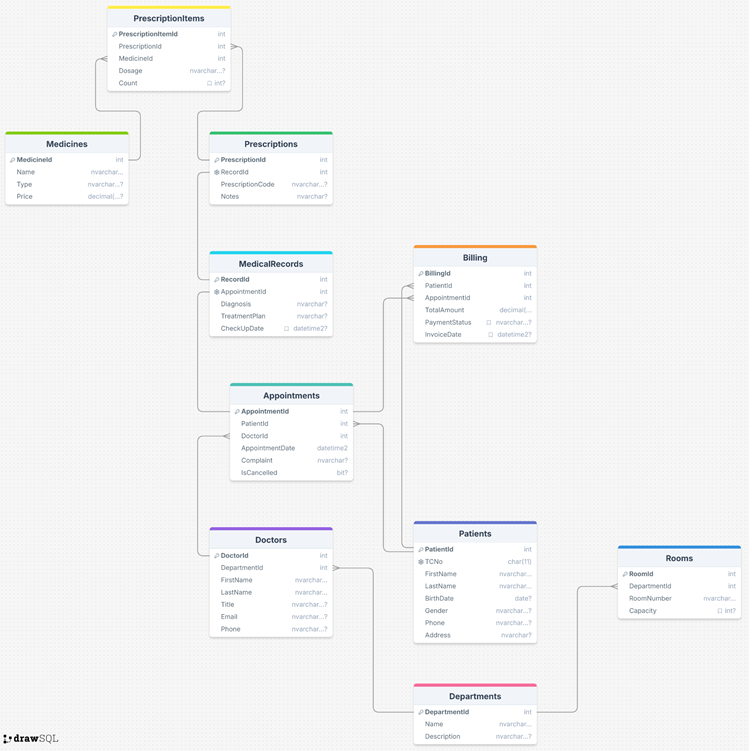

# 🏥 Hospital Automation

📌 Bu proje, **ödev** kapsamında geliştirilmiş temel bir hastane otomasyon sistemini modellemektedir.  
Doktor yönetimi, randevu akışı, muayene ve faturalandırma işlemlerini kapsar.

## ⚡ Proje Özellikleri
- 🏢 Bölümler ve doktor yönetimi
- 🧑‍⚕️ Hasta kayıt ve güncelleme
- 📅 Randevu oluşturma, listeleme ve iptal etme
- 📝 Muayene kayıtları ve reçete yönetimi
- 💳 Faturalandırma ve ödeme durumu yönetimi

## 🛠️ API Endpoints

### 🏢 Departments & Doctors
- `GET /api/departments` – Tüm poliklinikler
- `GET /api/departments/{id}/doctors` – Belirli bölüme ait doktorlar
- `GET /api/doctors` – Tüm doktorlar ve bölümleri

### 🧑‍⚕️ Patients
- `POST /api/patients` – Yeni hasta ekleme
- `GET /api/patients/{tcNo}` – Hasta detayları
- `PUT /api/patients/{id}` – Hasta güncelleme

### 📅 Appointments
- `POST /api/appointments` – Randevu oluşturma
- `GET /api/appointments/today` – Bugünün randevuları
- `PATCH /api/appointments/{id}/cancel` – Randevu iptal

### 📝 Medical Records & Prescriptions
- `POST /api/medicalrecords` – Muayene kaydı oluşturma
- `POST /api/prescriptions` – Reçete oluşturma
- `GET /api/patients/{id}/history` – Hasta geçmişi

### 💳 Billing
- `GET /api/billing/pending` – Ödenmemiş faturalar
- `PUT /api/billing/{id}/pay` – Faturayı ödenmiş olarak güncelle

---

## 🖼️ Veritabanı Şeması

